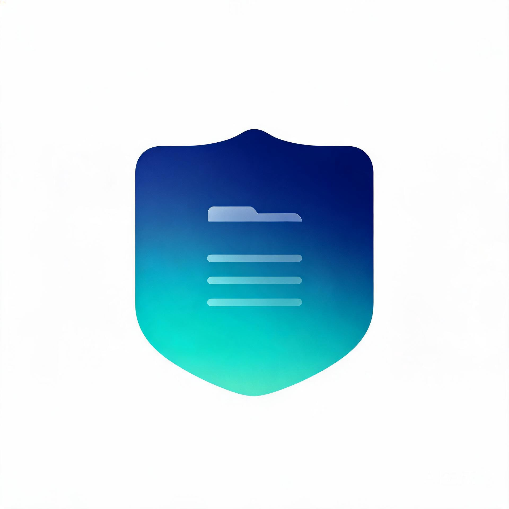
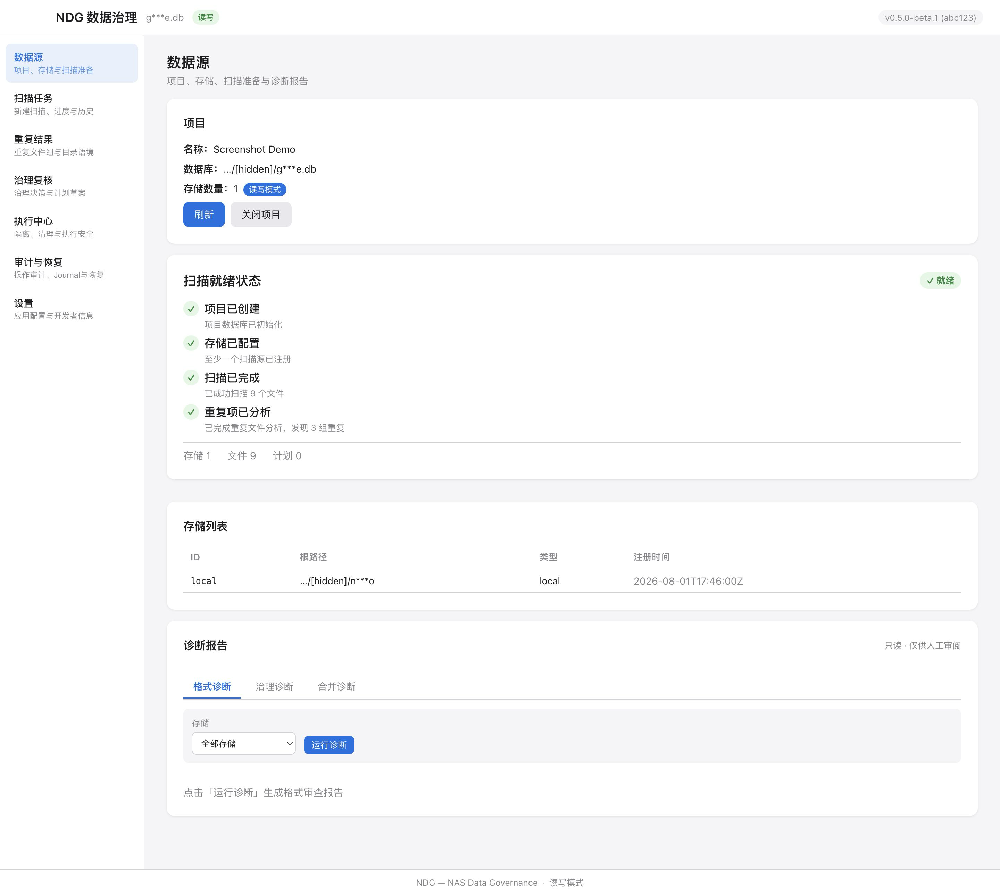
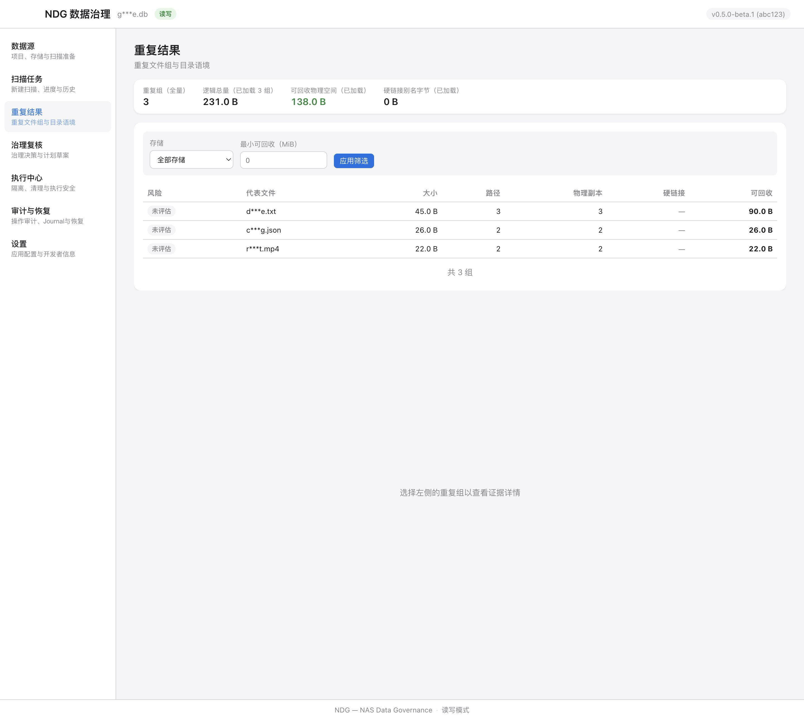

# NDG 数据治理工作台



面向个人、家庭和组织 NAS 数字资产的本地数据治理与归档工具。在你的 Mac 上安全扫描、识别重复文件、生成可审计的治理计划，全程只读分析，仅在明确批准后才执行可恢复的文件操作。

> **发布候选状态**：当前代码版本为 0.5.0-beta.1。核心扫描、复核、隔离与恢复流程已实现并通过自动化测试，当前仍处于发布前验收阶段。首个公开签名 DMG 尚未完成 Developer ID 签名、公证和实机安装验收。普通用户请等待 GitHub Releases 中发布经过验证的 Beta 安装包。

## 产品界面

**数据源与扫描就绪状态：**



**重复文件结果与目录语境保护：**



> 以上截图使用合成数据制作，已开启路径脱敏。完整界面说明请参阅 [用户指南](docs/user-guide/NDG-用户指南.md)。

## 核心能力

- **只读扫描**：九阶段扫描流程，支持增量哈希复用和断点续扫，扫描全程不修改任何源文件
- **分层哈希去重**：快速采样哈希筛选候选，完整 SHA-256 确认，识别硬链接和文件关系
- **目录语境保护**：自动推断 10 种目录角色，敏感/备份/原始素材等受保护目录的文件不会被自动清理
- **可审计治理计划**：草案→审批→新鲜度检查→执行→验证的完整生命周期，每一步都可追溯
- **隔离而非删除**：普通治理"删除"实际是移动到隔离区，可恢复；永久清理是独立的三步流程
- **崩溃恢复**：执行日志持久化，崩溃后保守回滚，拒绝歧义状态下的自动决策
- **完全本地运行**：不主动连接互联网服务，不包含遥测、云上传或外部 AI 调用

## 为什么内容相同不等于可以删除

即使两个文件内容完全一致，如果它们位于不同职责的目录（如一个是原始素材，一个是临时缓存），自动删除可能导致工作流断裂或数据丢失。

NDG 的核心原则是：**内容相同不等于可删除**。系统根据目录语境、文件格式、保护规则和保留评分生成建议，但对受保护文件、跨角色副本和高风险操作始终标记为需要人工复核。

## 安全工作流

```
扫描（只读） → 分析 → 生成草案(DRAFT) → 审批(APPROVED) → 新鲜度检查 → 执行(隔离) → 验证
                                    │                                          │
                                    └── 新鲜度失败 → 退回草案                     └── 回滚(可恢复)
```

- 扫描、分析、规划全程只读，唯一可写层（执行器）严格隔离
- 不跟随符号链接、不跨挂载点、不越过任务根目录
- 执行前校验文件大小/时间/inode/设备/哈希五维一致性
- 文件移动遵循"先复制 → SHA-256 验证 → 删除源"管道
- 受保护目录的文件隔离后自动进入 HOLD 状态，永不自动清除

## 下载与安装

### 系统要求

- macOS 13.0 或更高版本
- Apple Silicon
- 需要读取权限访问待扫描的 NAS 或本地目录

> 当前版本仅提供 Apple Silicon 构建。Intel Mac 支持将在后续版本中评估。

### 安装步骤

首个公开 Beta 发布后，可从 [GitHub Releases](https://github.com/FNB2026/nas-data-governance/releases) 下载签名并公证的 DMG。

1. 下载 `NDG-<版本号>-macos.dmg`
2. 双击打开 DMG，将 NDG 应用拖入"应用程序"文件夹
3. 如果 macOS Gatekeeper 提示"无法验证开发者"，请停止打开，核对下载来源和 SHA-256 校验和，并通过项目 Issue 报告

> 官方公开 DMG 应通过 Apple Developer ID 签名和 Apple 公证，正常情况下不需要点击"仍要打开"。

## 三步快速开始

首个公开 Beta 发布后：

1. **下载 DMG** — 从 GitHub Releases 下载并安装 NDG
2. **选择待扫描目录** — 打开 NDG，新建项目，选择 NAS 挂载目录或本地文件夹
3. **开始扫描** — 点击开始扫描，完成后在"重复结果"页面查看重复文件组

详细操作说明请参阅 [用户指南](docs/user-guide/NDG-用户指南.md)。

## 隐私与本地运行

NDG 不主动连接互联网服务：当前不包含遥测、云上传、远程 API 或外部 AI 调用。当用户选择已挂载的 NAS 目录时，文件访问由 macOS 通过 SMB、NFS 等已配置的文件系统连接完成。NDG 不会把扫描结果发送到 NDG、FNB 或其他第三方服务器。

- **无遥测**：不收集任何使用统计、崩溃报告或性能数据
- **无第三方云上传**：不会将你的文件、文件名、路径、哈希值或元数据发送到 NDG、FNB 或其他第三方云服务
- 用户主动选择的 NAS 扫描源、目标目录和隔离目录会按操作要求，通过 macOS 文件系统进行读取或写入
- 哈希计算、重复检测、治理分析和决策逻辑由 Mac 本地进程完成
- 项目数据库和应用设置保存在 Mac 应用支持目录，隔离文件保存在用户指定的隔离根目录（可能位于本地磁盘、外接存储或 NAS）

完整隐私声明见 [用户指南第 9 章](docs/user-guide/NDG-用户指南.md#9-隐私安全与数据不上传声明)。

## 用户指南与支持入口

| 需求 | 入口 |
|---|---|
| 完整使用说明 | [用户指南](docs/user-guide/NDG-用户指南.md) |
| 使用问题和缺陷报告 | [GitHub Issues](https://github.com/FNB2026/nas-data-governance/issues)（请使用合成数据，勿上传真实路径） |
| 安全漏洞报告 | [安全政策](SECURITY.md)（请使用 GitHub Security Advisory 私密报告） |
| 贡献代码 | [贡献指南](CONTRIBUTING.md) |
| 行为准则 | [行为准则](CODE_OF_CONDUCT.md) |
| CLI 开发与调试 | [CLI 开发与调试指南](docs/development/CLI-开发与调试指南.md) |

## 开发与构建

### 环境要求

- Go 1.26+（以 go.mod 中声明的 Go 版本为准）
- Node.js 22+
- Wails CLI v2.13.0

### 构建

```bash
# 克隆仓库
git clone https://github.com/FNB2026/nas-data-governance.git
cd nas-data-governance

# 运行测试
make test
make vet
go test -race -count=1 ./...

# 构建 CLI
make build

# 构建桌面应用
go install github.com/wailsapp/wails/v2/cmd/wails@v2.13.0
make desktop-build

# 公共仓库边界检查（确保无敏感文件进入版本库）
make public-check

# 版本一致性检查
make version-check
```

### 技术栈

- 后端：Go（Wails v2 桌面框架）
- 前端：React + TypeScript
- 数据库：SQLite（WAL 模式，0600 权限）
- CI/CD：GitHub Actions（golangci-lint、actionlint、Gitleaks、Govulncheck）

## 开源许可

- 软件代码、构建文件和实现类 schema：[Apache License 2.0](LICENSE)
- 原创文档与白皮书：[CC BY 4.0](LICENSE-DOCS.md)
- 第三方组件：按 [第三方声明](THIRD_PARTY_NOTICES.md) 及随发布包提供的上游许可文本执行
- "NDG" 名称、Logo 和品牌素材不随上述许可自动授权；如需在分发或衍生项目中使用品牌素材，请先通过 Issue 联系维护者

## 参与和支持

- 提交改动前请阅读 [贡献指南](CONTRIBUTING.md) 和 [工程护栏](AGENTS.md)
- 普通使用问题和已脱敏的缺陷请按 [支持说明](SUPPORT.md) 处理
- 安全问题必须遵循 [安全政策](SECURITY.md)，不要在公开 Issue 中提交真实路径、文件名、数据库、索引或日志
- 本地及 CI 的公开边界检查：`make public-check`
