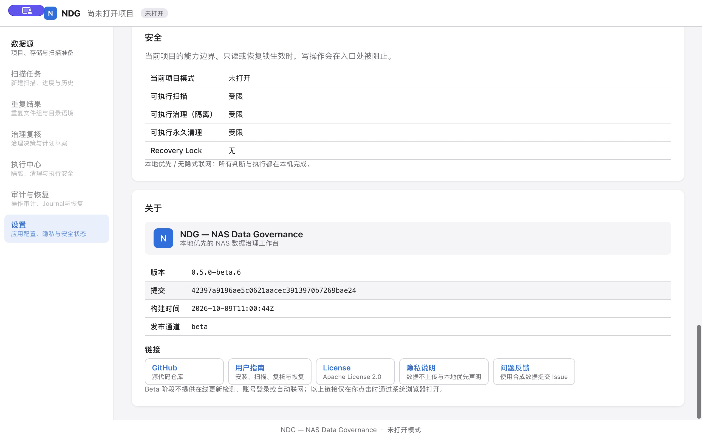

# beta.6 正式发行物与 SMB Resume 验收 — 2026-10-09

## 结论与证据边界

- **正式 beta.6 SMB FULL_HASHING → PAUSED_NETWORK → 重挂载 → GUI Resume → 自然 COMPLETED：PASS。**
- **本轮异常窗口隐私：PASS（限定正式 App PID 的统一日志、stdout/stderr 与新验收项目的持久化 GUI 事件）。** 不代替全系统、WebKit 子进程全覆盖或长时日志门禁。
- 新候选为 **Draft / pre-release**；Public Beta **BLOCKED**。全新 Mac 离线首次安装尚无 beta.6 证据；Disposable Quarantine / Restore、Crash Recovery / Recovery Lock 与长时隐私仍 **NOT RUN**。
- beta.5 的 SMB Resume **FAIL** 永久保留；本次 PASS 只属于下面的 beta.6 正式发行物，不能回填旧 DMG。历史记录：[冻结的 PR #56 专题](https://github.com/FNB2026/nas-data-governance/blob/96575a84882525cc1a96e775dae3676a52487ddc/docs/release/beta.5-smb-network-resume-acceptance-2026-10-09.md)。

## 不可变发行身份

| 项目 | 实际证据 |
|---|---|
| 修复基线 | PR #57，main `2d360ca40fd9e4a2ef26f89df9a836e1d8c7aba8` |
| 版本 PR | [#59](https://github.com/FNB2026/nas-data-governance/pull/59)，独立复核 PASS 于 HEAD `4ae89c9da2ee5d7c41c7ffde50c8df31697b781b`；四项 required checks PASS，已合并 |
| 最终 RC SHA | `42397a9196ae5c0621aacec3913970b7269bae24`，版本 PR 的合并提交；不是 PR #57 SHA |
| 版本 / 构建号 | `0.5.0-beta.6` / `6`；bundle marketing `0.5.0`，channel `beta` |
| annotated Tag | `v0.5.0-beta.6`；object `f3b93b7ead24b947f4bd1d5887fefbef23ccf18b`，peel = RC SHA |
| main Gate | [CI 37920233723](https://github.com/FNB2026/nas-data-governance/actions/runs/37920233723)：Verify、Desktop Build PASS；[Security 37920255560](https://github.com/FNB2026/nas-data-governance/actions/runs/37920255560)：Gitleaks、Govulncheck PASS |
| Release workflow | [37920672874](https://github.com/FNB2026/nas-data-governance/actions/runs/37920672874)：Verify、Build Unsigned、Sign & Notarize、Draft GitHub Release 全部成功 |
| 环境审批 | release-macos 的既有 reviewer 流程；审批绑定本 RC SHA，未改变保护规则 |
| signed-dmg artifact | ID `11611384112`；最终验收使用 GitHub Draft 下载资产，未使用临时 artifact 或 dev App |
| Apple submission | `95e495e9-688d-4433-bd02-c225a32d5771`，**Accepted** |
| GitHub Release | ID `407830588`，`draft=true` / `prerelease=true`；登录仓库 writer 后从 [Releases 列表](https://github.com/FNB2026/nas-data-governance/releases)访问，不能视作公开下载链接 |
| About | 完整 Commit = RC SHA；BuildTime `2026-10-09T11:00:44Z`；channel `beta`，GUI 实际观察 |

Tag 通过普通 `git push` 新建；服务端报告对 Tag creation restriction 使用账户已有的 maintainer bypass 权限。没有修改或禁用 ruleset，没有覆盖/移动旧 Tag。

beta.5 的 object `3b519f6b8c38f5f35ed313ef9fac1d8f0feac2ec` / peel `8473dd630c4165389b32ffc85ae062145546a766` 未变。其 Release ID `401795345` 的资产 ID、size、digest 和 Draft 标记在本轮前后核对一致。

## GitHub Draft 实际资产与安装检查

| 资产 | ID | bytes | SHA-256 |
|---|---:|---:|---|
| NDG-0.5.0-beta.6-macos.dmg | 624718925 | 6,357,875 | `8c21b4e39b65ba603bc380e01324c9b1abd09dab02e12ad3c0765b6bc776415d` |
| NDG-0.5.0-beta.6-macos.dmg.sha256 | 624718922 | 93 | `32f82c7fba5ed2265202b8d1b7120499ee500a49df2829de4d1f681915cf8900` |
| sbom.cyclonedx.json | 624718921 | 45,554 | `01c7bebeadefc6429986e807c38659cc8485c1c42bba6abd9daee06a5d5fd332` |
| sbom.spdx.json | 624718923 | 80,459 | `5797329ab5e9e92c65c49517878662bf3313a9a7f4d75de42a3f09ab0e59def0` |

下载使用已认证的 GitHub Release asset API；四项资产实际 digest 一致，DMG 的 `.sha256` 与下载文件一致。CycloneDX **59** components / SPDX **55** packages；两种格式不同数量不表示丢失组件，保留原资产。

- `xcrun stapler validate` DMG：exit 0；`spctl --assess --type open --context context:primary-signature`：exit 0，Notarized Developer ID。
- DMG codesign verify、包内 App deep/strict signature verify、App execute Gatekeeper：全部 exit 0。
- Developer ID Application：Guangzhou Yipeng Interconnected Technology Co., Ltd.；Team `A2DYS82NLA`，bundle `com.fnb.ndg`，Hardened Runtime flag `0x10000(runtime)`。
- 安装执行文件与 Draft DMG 包内文件字节一致，安装后签名检查通过；旧 beta.5 App 保留可恢复副本（执行文件 SHA-256 相同）。没有使用“仍要打开”、清除 quarantine 或 ad-hoc 重签名。
- 先由正常 App/LaunchServices 路径启动并核对 About；随后重启**同一已安装签名执行文件**采集 stdout/stderr，GUI 操作继续用 Computer Use。没有改 bundle、注入 dev build 或改产品代码。
- 当前 Mac 已运行过 NDG。**beta.6 零接触 Mac 离线首次安装：BLOCKED（缺独立机器实际证据）**；beta.5 历史首装结果不能替代。
- 按既有流程确认 DMG staple；未声称 nested App 独立 staple。使用 macOS `plutil` 解析包内 plist 成功，bundle build 为 6。

## 安全隔离与尝试记录

测试服务只绑定 loopback 专用端口，以独立 share 导出本机新建合成文件；服务 read-only，客户端 mount 使用 `ro,nobrowse`。没有关闭整机网络、卸载真实 NAS 共享、扫描百万级项目、改原 beta.5 DB 或执行隔离/清理。

本轮保留所有尝试，未用未触发中断的扫描替代正式成功链：

1. 原生目录选择器第一次沿用了旧 disposable 测试目录，新建项目扫描了旧夹具的 6 个合成文件。**目标误选，INCONCLUSIVE，不计入 beta.6 基线**；没有改旧文件或旧失败 DB。后续在启动前用只读 DB 核对实际 registered root 与新共享完全一致。
2. 正确七文件小夹具正常 baseline 为 7/7、full 6/6、groups 3/3、single full 0。中断尝试的 FULL_HASHING 太快，自然完成前未实际触发故障：**INCONCLUSIVE**，DB/源保留。
3. 另建七文件目录（三对各 32 MiB + 7,500-byte 普通单例），独立 baseline DB 正常完成：7/7、full 6/6、groups 3/3、single full 0。再创建零缓存的新中断 DB；先卸载/重挂专用卷清除基线客户端缓存，仅对测试服务 read 加 50 ms 延迟并使用 1 worker，以观察真实 FULL_HASHING。全量扫描开关保持关闭。

所有成功链证据对应第三项。七文件的匿名标签、中断前正常基线与最终文件哈希、真实路径/文件名/业务 canary、各 DB 与未脱敏截图仅保存在本机私有证据档案，未上传普通文档或日志。

## 实际网络中断与恢复链（UTC）

| 时间 / 阶段 | 实际状态与持久化证据 |
|---|---|
| 11:15:53 | 中断项目 checkpoint 1：running / scanned_count **7**；7 个文件与 quick hashes 已持久化 |
| 11:16:20 | GUI 和 DB 同时确认 RUNNING / **FULL_HASHING**，job `job-a05f03315d055d4c72f706d92fb94184`；停止专用 SMB PID，端口确认不可达。此时 DB full 0/6 |
| 停服务后的系统等待 | macOS 当前 read 仍等待 SMB 重新连接，UI 暂时维持 FULL_HASHING。没有取消任务，也没有将“端口断开”直接判为暂停成功 |
| 11:19:30 | 只对已核对的 loopback 专用挂载执行强制卸载，使实际 I/O 返回失败；其他 mount session 前后完全一致。App 自然 **PAUSED_NETWORK**；checkpoint 1 = paused_network / **7**；文件 active 7、quick 7、full 0、groups 0；网络失败 2、warning 1（预期故障结果） |
| 重挂与 Resume | 专用 read-only 服务重启并按相同 registered root 重挂；7 文件存在；关闭测试读延迟；正式 GUI 点击“继续扫描”，未点击“开始扫描”、未新建全量扫描 |
| 11:20:25 | 新执行 job `job-70c65663d8a50189a08bb6352388e045` 自然 **COMPLETED / FINALIZING**，warning 0、error_code 空；**同一个 checkpoint 1 = completed / 7** |

本轮 Resume 没有新遍历文件，实时 discovered/processed 为 **0/0**（durable progress JSON `{}`），failed 0。内容待办恢复不增加本轮遍历计数。通过标准来自恢复前缀的六份真实完整 SHA-256、最终组/覆盖/持久化与终态，而不是 UI 计数增长。

### 最终一致性与 GUI

- 原 durable prefix **7 → 7**，原 checkpoint ID **1** 复用；7 个预期匿名文件精确覆盖；quick **7/7**。
- 六个重复候选 full **6/6**，每个 SHA-256 与中断前正常扫描基线及归档保留源字节匹配；重复组 **3/3**；普通单例 full **0/1**，未退化为全量强制完整哈希。
- file_status：active **7**，missing **0**，unavailable **0**；仅有 scan jobs，没有执行/隔离/删除任务。没有未解释的完整哈希候选待办。
- 六个重复候选的中断前基线 / 恢复后完整 SHA-256 / 归档源字节一致；七文件 size 与 quick hash 在基线及恢复后均一致。只读服务和只读挂载阻止源写入。没有保存成功大夹具创建时七文件的独立 SHA-256 清单，不能将旧小夹具 manifest 的 expected_hashes 用作该证据；普通单例没有独立的创建时完整 SHA-256，源保护证据限于只读边界、size 与 quick hash 一致。本次结论限于合成夹具，未在真实 NAS 执行操作。
- GUI Resume 入口消失；COMPLETED 可见，PAUSED_NETWORK 的历史任务保留。
- Duplicate Results 显示 **3** 个组；打开一组实际看到 SHA-256、两份 32 MiB 文件证据与目录语境。网络物理身份显示“不可靠”，目录角色 unknown 与人工确认要求保留，没有自动授予删除许可。
- 完成后正常卸载专用测试卷并停止其服务；其他 mount session 核对未变。源文件、项目 DB、历史不确定尝试及最终一致性快照保留。

## 异常窗口隐私与私有证据

采集窗口 UTC **11:05:27–11:22:33**，实际签名 App PID **49447**。扫描 128 个测试路径、文件名、业务锚点及编码/转义变体；包含本轮创建项目的错误目标尝试和所有正确目标尝试。

| 表面 | 实际数量 | 标记命中 |
|---|---:|---:|
| App stdout | 0 bytes（持续重定向采集，App 未输出） | 0 |
| App stderr | 0 bytes（持续重定向采集，App 未输出） | 0 |
| App PID 统一日志 | **43,794,612 bytes / 37,704 records**，stream JSON 完整解析 | 0 |
| 新验收 DB 持久化 GUI job events | **356**（最终中断/恢复项目 **241**） | 0 |

状态事件包含 FULL_HASHING、PREPARING_RESUME、SEEKING_RESUME、PAUSED_NETWORK 和 COMPLETED。stdout/stderr 为实际空流，不能把没有产生的输出编造成已测试的错误文本；网络异常可观测证据来自 GUI、job events 和 checkpoint。

真实路径/文件名/测试标记、DB、raw stdout/stderr、统一日志、截图与 SHA-256 索引已保存在用户本机 NDG App Support 下独立 acceptance-evidence 档案（owner-only），临时原件同时保留。关闭项目的 DB 无 WAL，字节复制到私有快照后用 immutable read-only SQLite 读取事件；活动最终 DB 通过 mode=ro SQLite backup 得到一致性快照，没有修改原项目。

| 私有证据匿名名称 | SHA-256 |
|---|---|
| 最终 DB snapshot（356,352 bytes） | `66d2b197e06c375d67fb798c2a66d7b5e2aff75d97c9d9106e46f80ecb7f4df4` |
| 实际 FULL_HASHING GUI 截图 | `e0f2fc37da7fd294071d89c082fd2a6771f70e5d487e60697ee285f51f94c359` |
| PAUSED_NETWORK GUI 截图 | `48fb55ff2bb26f5c320de8a215be17958a5df2f595c247623d55ee7c9185dd65` |
| Resume COMPLETED GUI 截图 | `2693c1150b3890117f2b07ba80b5a939ff5237e53d25e42a1b3a4a05c116505d` |
| 重复组/目录语境 GUI 截图 | `713580c679cea25608aab0e3251a2811dbb601ce31957a360ce1b0a9ce0754b5` |
| App PID 统一日志 | `8b2016bb33afd62687c886f0e7d4a4852851307da798368845b7e55834bb04b0` |
| 隐私检查汇总 | `03daa52f5405f35ca8641f19d591e38c514cbc39e183723dc4c11c514b19bc23` |

## 已知安全报告项

本 RC 的 main CI 实际 `npm audit` 报告 **1 high**：构建依赖 `source-map-js`，`GHSA-68fv-2mgg-jv7q`。audit step exit 1；既有工作流将其列为报告项，所以整体 Verify 仍成功。Gitleaks / Govulncheck PASS 不表示这一 npm advisory 已消除。本轮未修改依赖，也未将 CI 绿灯解释为零漏洞；后续 Public Beta 安全判定仍需处理该报告，候选资产保持冻结。

## 下一道 Gate

正式发行物的 SMB Resume 与本次限定异常窗口隐私已经具备 PASS 证据。随后独立执行的 [Disposable Quarantine / Restore](beta.6-quarantine-restore-acceptance-2026-10-10.md) 总体 **FAIL**：文件闭环通过，但计划持久化终态及陈旧拒绝结果不一致，修复任务 [#62](https://github.com/FNB2026/nas-data-governance/issues/62)。该后续结果不改写本记录的 SMB PASS。Crash Recovery / Recovery Lock 未运行且被前置 FAIL 阻断；零接触 Mac 离线首装、长时隐私及剩余门禁仍待完成。新候选保持 Draft，不直接发布 Public Beta，不重生成/替换这份 DMG。
