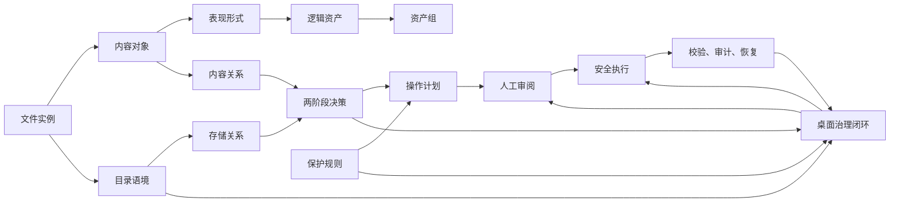

# 知识地图

```mermaid
flowchart LR
  FI[文件实例] --> CO[内容对象]
  CO --> RP[表现形式]
  RP --> AS[逻辑资产]
  AS --> AG[资产组]
  FI --> DC[目录语境]
  CO --> CR[内容关系]
  DC --> SR[存储关系]
  CR --> DM[两阶段决策]
  SR --> DM
  DM --> OP[操作计划]
  PP[保护规则] --> OP
  OP --> RV[人工审阅]
  RV --> EX[安全执行]
  EX --> AU[校验、审计、恢复]
  DC --> UI[桌面治理闭环]
  DM --> UI
  PP --> UI
  UI --> RV
  UI --> EX
  AU --> UI
```

知识卡按“对象—判断—约束—流程—工程”组织。入口为 [核心原则](../cards/00-core-principles.md)；桌面端接线约束见 [桌面治理闭环](../cards/11-desktop-governance-workflow.md)。
